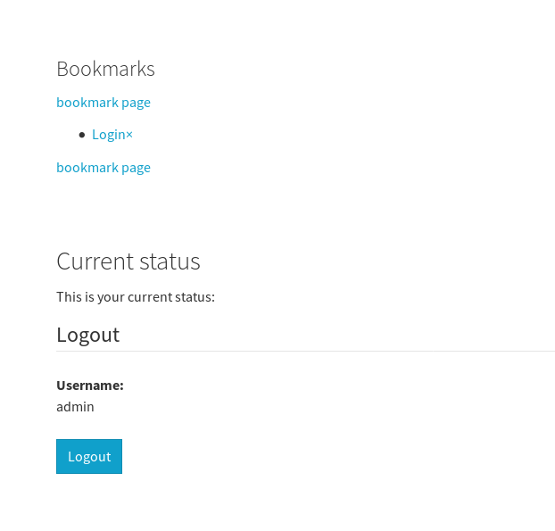

.. ==================================================
.. FOR YOUR INFORMATION
.. --------------------------------------------------
.. -*- coding: utf-8 -*- with BOM.

.. include:: ../Includes.txt

==============================
Configuration
==============================

The plugin output doesn't look very cute after install. It is necessary to adopt it to your needs. Nevertheless it shouldn't be too hard.

.. tip::

    Keep in mind that the plugin is silent unless you're logged in.

Make it work
============

Here are the needed steps described to make the plugin work.

Additional work might be needed to adapt is to your needs. Usually this is limited to template work.

1. Include TypoScript
---------------------

Include the TypoScript in your template record or your site package.

2. Include Plugin
-----------------

Include the 'Bookmark Pages' plugin as content element. This is just for testing and not usually what you want.

Login and you should see some output. On the introduction package it looks like this:

    The login box is not part of this extension.

Customization
=============

1. TypoScript and Templates
---------------------------

You may just copy the needed parts to your site package.

The fluid template paths can be configured as usual using TypoScript. Have a look into the TypoScript template
(look for plugin.tx_bookmarkpages.view)

2. JavaScript and JQuery
------------------------

The provided example uses JQuery for ajax requests. JQuery is included by TypoScript. You might want to remove that with:

.. code-block:: typoscript

   page.includeJSFooterlibs.bookmark_pages_jquery >

If you don't use JQuery you have to adapt the JavaScript which is used for the bookmark button.
Have a look into Resources/Public/Scripts/JavaScript/bookmark_pages.js

3. Include in your page template
--------------------------------

The rendering of the bookmarks list might be something you want to include into your page template. This could be done
in a fluid template like this:

.. code-block:: html

    <f:cObject typoscriptObjectPath="tt_content.list.20.bookmarkpages_bookmarks"/>

Of course you want a bookmark button on every page. This can be done in fluid like this:

.. code-block:: html

    <a class="bookmark-ajax-submit bookmark-this-page"
    data-ajaxuri="{t:uri.ajaxAction(extensionName: 'bookmarkpages', pluginName: 'Bookmarks', controller: 'Bookmarks', action: 'bookmark', contextRecord: 'currentPage')}"
    >bookmark page</a>

You can place the snippet in any template not just the plugin templates.

