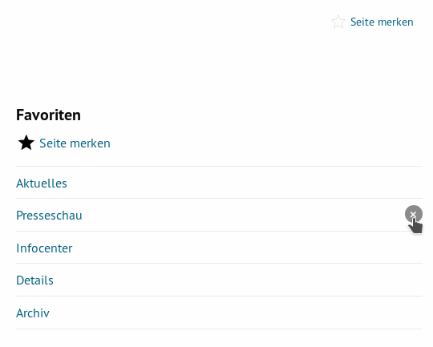

.. include:: ../Includes.txt

Introduction
============

What does it do?
----------------

This is a TYPO3 plugin that provides bookmarks functionality of local pages.
For example this is very helpful for intranet websites.

The plugin can be configured to use the browsers local storage allowing non registered users to use the feature too.
In case a website user likes to have the bookmarks available on different devices a frontend account might be used.
After logging in the bookmarks are saved to the server hence might be accessed from within any device.

TypoScript and fluid templates are just examples. Adapt it to your needs.

The extension was created by `René Fritz <https://github.com/colorcube>`__. The ownership has been transferred in
april 2021.

Screenshots
-----------

   The screenshot shows the functionality, the styling is not included.

You have a list with bookmarks which can be deleted and you can place a 'bookmark' button anywhere on the page.

